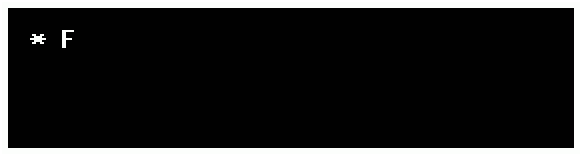

# PolishTale (an Undertale translation mod)
<div style="display: flex; align-items: center;">
    
</div>
<br/>
<br/>
<br/>
<br/>

## Status: 70% complete!
(current translated areas consist of: Ruins, Snowdin, Waterfall; as well as most of the underground monsters)
<br/>
<br/>

# Instrukcja pobierania

## Metoda 1.  Klonowanie repozytorium
Otwórz PowerShell (lub Git Bash) i wpisz poniższe komendy, aby sklonować repozytorium i uruchomić Undertale:

```bash
git clone https://github.com/justPoosay/PolishTale.git
cd PolishTale/Undertale
.\Undertale.exe
```

## Metoda 2.  Ręczne pobieranie repozytorium
W branchu **main**: <> Code → Download ZIP <br/>
Po pobraniu wypakuj plik ZIP i przejdź do wypakowanego folderu, następnie otwórz folder Undertale i uruchom Undertale.exe
<br/>
<br/>

## Trailer:
[](https://youtu.be/LdV79crBDuo)
